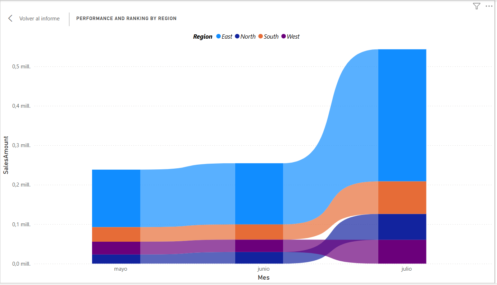

# Region Performance and Ranking

## Description
This project analyzes the performance and ranking of different regions using a Ribbon chart. The goal is to visualize sales changes over the months and identify which region has the highest sales.

## Instructions

1. **Select the Ribbon chart from the Visualizations pane.**

2. **Drag and drop `Sales Amount` into the `Y-axis` well and `Month` from `Order Date` into the `X-Axis` well.**
   - This will display sales changes over the months.

3. **Drag and drop the `Region` field into the `Legend` well.**
   - This will differentiate the sales data by region.

4. **Drag and drop `Marketing Spend` into the `Tooltips` field.**
   - This will show the marketing spend value in correlation with the sales changes.

5. **Hover the mouse over the region with the highest sales.**
   - For example, the tooltip displayed when hovering over this region might tell you that it's the East region and the values are for July.

## Visualizations

Here is an example of how the Ribbon chart would look with the provided data:

## Conclusions
- **Top-Performing Region:** By hovering over the chart, we can identify the region with the highest sales and analyze its performance over time.
- **Correlation with Marketing Spend:** The tooltips provide insights into how marketing spend correlates with sales changes.
- **Monthly Sales Trends:** Observe trends and patterns in sales across different months.

---
*This project was carried out as part of the Microsoft Certified: Power BI Data Analyst Associate (PL-300) certification.*
